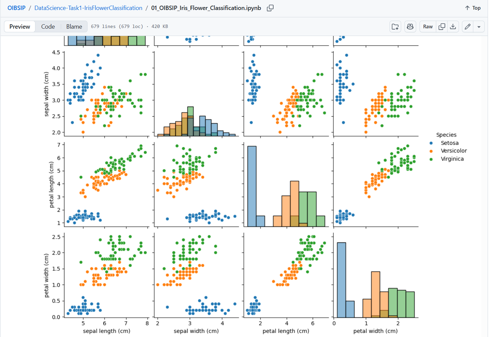
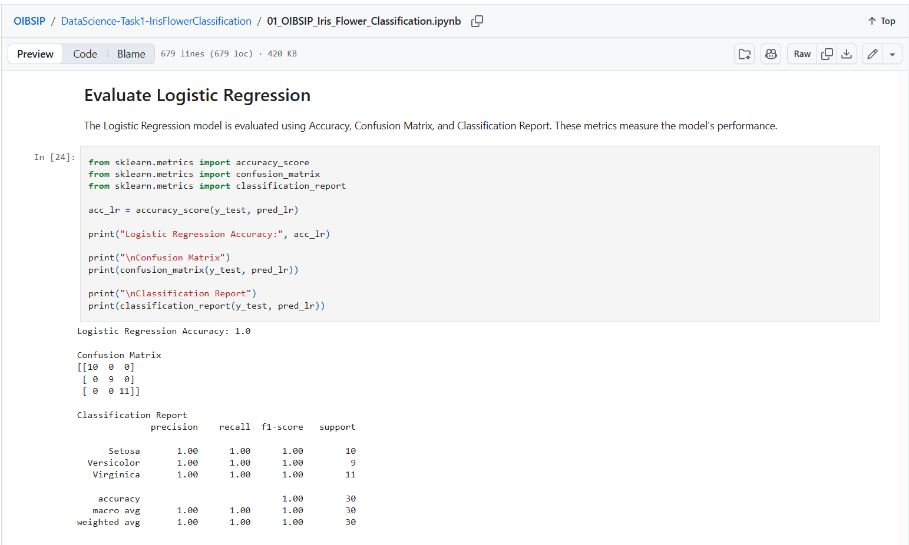
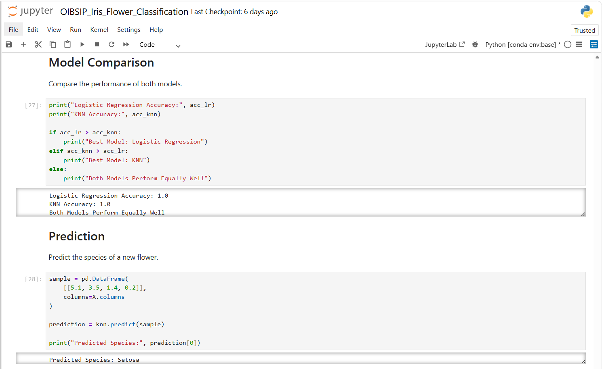

# 🌸 Iris Flower Classification

> **Track:** Data Science  
> **Organization:** Oasis Infobyte  
> **Task:** Iris Flower Classification

---

## 📌 Project Overview

This project predicts the species of Iris flowers using Machine Learning classification algorithms based on flower measurements.

---

## 🎯 Objectives

- Analyze the Iris dataset
- Train classification models
- Compare model performance
- Predict the flower species

---

## 🛠️ Technologies Used

- Python
- Pandas
- NumPy
- Matplotlib
- Seaborn
- Scikit-learn
- Jupyter Notebook

---

## 🤖 Machine Learning Algorithms

- Logistic Regression
- K-Nearest Neighbors (KNN)

---

## 📂 Files

- `01_OIBSIP_Iris_Flower_Classification.ipynb`

---

## 📈 Results

✔️ Successfully classified Iris flower species with high accuracy.

---

## 📷 Outputs

### Pair Plot

### Dataset Preview

### Prediction Result

---

## 🙏 Thank You

Thank you for visiting this project.

If you found this project helpful, feel free to ⭐ star this repository and explore my other projects.

Happy Coding! 🚀
