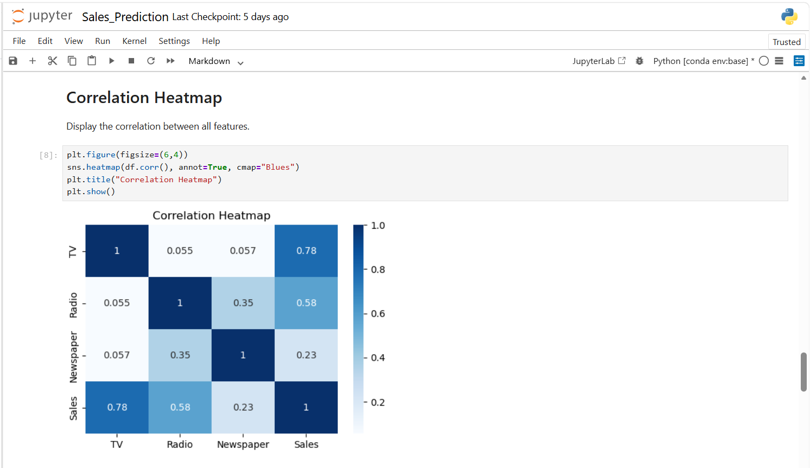
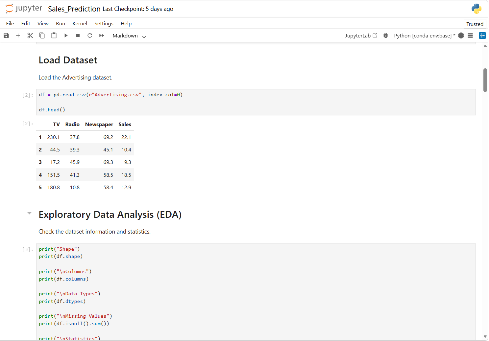
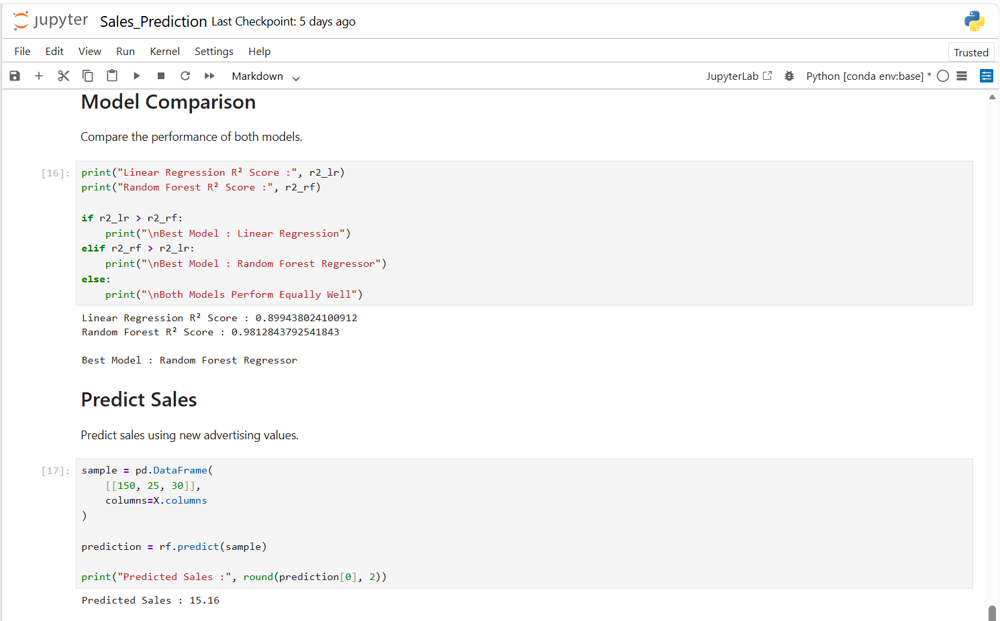

# 📈 Sales Prediction using Machine Learning

> **Track:** Data Science  
> **Organization:** Oasis Infobyte  
> **Task:** Sales Prediction

---

## 📌 Project Overview

This project predicts product sales using advertising expenditure data and Machine Learning regression algorithms.

---

## 🎯 Objectives

- Analyze advertising dataset
- Train regression models
- Compare model performance
- Predict sales values

---

## 🛠️ Technologies Used

- Python
- Pandas
- NumPy
- Matplotlib
- Seaborn
- Scikit-learn
- Jupyter Notebook

---

## 🤖 Machine Learning Algorithms

- Linear Regression
- Random Forest Regressor

---

## 📂 Files

- `02_OIBSIP_Sales_Prediction.ipynb`

---

## 📈 Results

✔️ Successfully predicted product sales with high accuracy.

---

## 📷 Outputs

### Correlation Graph

### Dataset Preview

### Prediction Result

