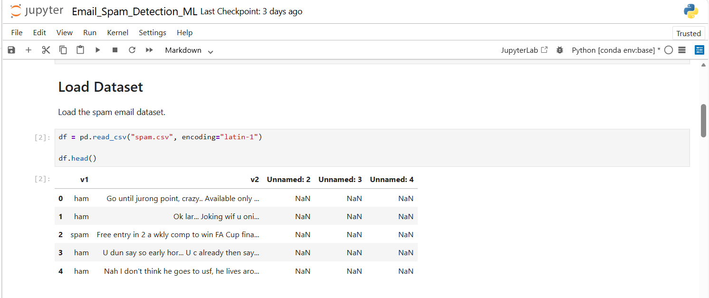
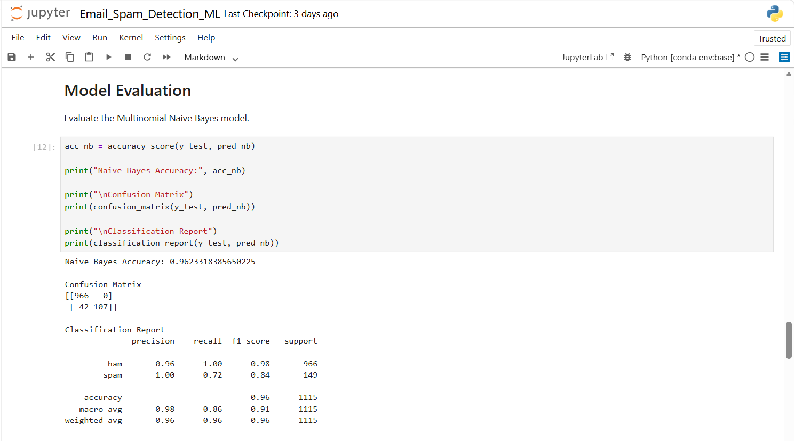
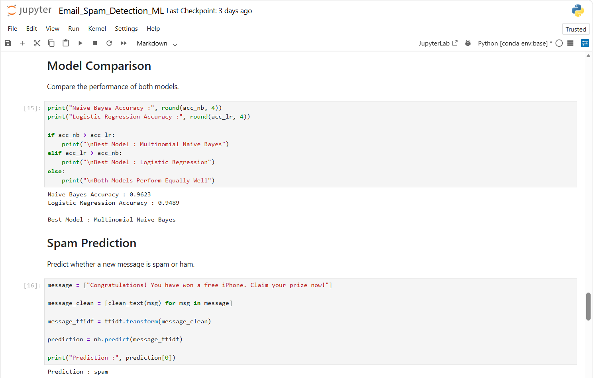
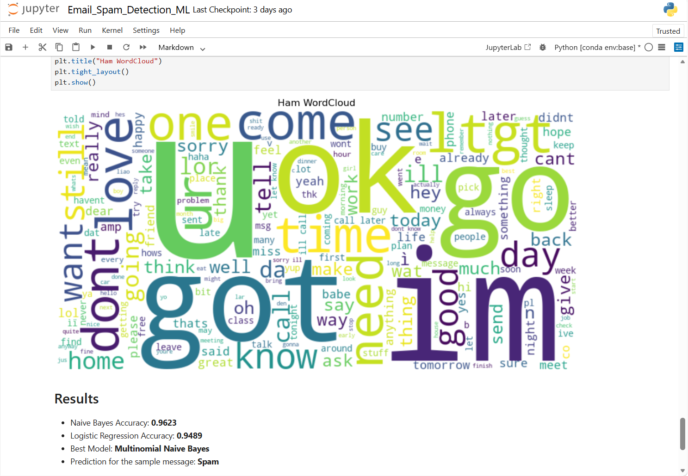

# 📧 Email Spam Detection using Machine Learning

> **Track:** Data Science  
> **Organization:** Oasis Infobyte  
> **Task:** Email Spam Detection

---

## 📌 Project Overview

This project classifies emails as Spam or Ham using Natural Language Processing and Machine Learning algorithms.

---

## 🎯 Objectives

- Analyze email dataset
- Preprocess text data
- Train classification models
- Detect spam emails accurately

---

## 🛠️ Technologies Used

- Python
- Pandas
- NumPy
- Matplotlib
- Seaborn
- NLTK
- Scikit-learn
- TF-IDF Vectorizer
- Jupyter Notebook

---

## 🤖 Machine Learning Algorithms

- Multinomial Naive Bayes
- Logistic Regression

---

## 📂 Files

- `03_OIBSIP_Email_Spam_Detection.ipynb`

---

## 📈 Results

✔️ Successfully classified Spam and Ham emails with high accuracy.

---

## 📷 Outputs

### Dataset Preview

### Prediction Result

### Model Performance

### Word Cloud

---

##😊 Thank You

Thank you for visiting this project.

If you found this project helpful, feel free to ⭐ star this repository and explore my other projects.

Happy Coding! 🚀
